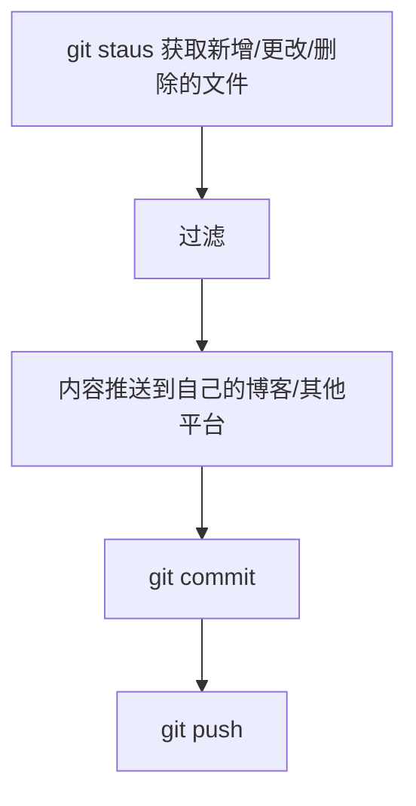

# Git提交时推送到别的平台


由于本人写笔记一一直都是写 markdown 然后提交的github，再配合 docsify 生成的静态站点，搭的也有博客，但是很少去更新

我就想能不能在提交到github的时候顺带把笔记也推到自己的博客网站呢？

git虽然有钩子函数，但是对于不经常写shell的人来说很难上手，于是就用nodejs实现了下面这套逻辑：





如果你不想提交到远程仓库，可以使用 `git init` 初始化一个本地仓库，把他当作一个命令行工具使用，不需要 `git push` 


**源码：** https://github.com/cloudlandboy/sync-post-commit


## 安装

```shell
npm install sync-post-commit -g
```


## 使用

1. 打开终端

2. 进入git项目目录

3. 提交

   ```shell
   sync-post-commit commit 'git commit message'
   ```


## 配置

你可以在控制台运行 `sync-post-commit config` 命令进行引导配置

也可以自己编辑配置文件，配置文件位于 `用户目录/.sync-post-commit/config.json`

```json
{
  "postImpl": "实现名称",
  "filter": {
    "mode": "disable|s|i|e|si|se",
    "extension": ["md"],
    "include|exclude": ["**/_sidebar.md","/README.md"]
  },
  "实现名称": {
    "实现配置xx": "xxValue",
    "modulePath": "/home/clboy/halo-impl.js"
  }
}
```


## 内置实现

- [x] halo ( 1.x版本 )
- [x] csdn
- [x] 语雀
- [ ] 印象笔记 (TODO)
- [ ] 博客园 (TODO)
- [ ] 简书 (TODO)


## 自定义推送实现

示例 **impl.js**

```javascript
async function post(utils, context) {
    context = Object.assign({}, context);
    // 推送逻辑
}

async function configure(utils, implConfig) {
    return utils.prompts([{
        type: 'text',
        name: 'key',
        initial: implConfig ? implConfig.key : null,
        message: '配置xxx: ',
    }])
}
```


------

`utils` ：

- `fileExists(path)` : 判断文件是否存在，参数：文件绝对路径
- `removeBlankItem(stringArray)` : 删除字符串数组中的空白字符元素
- `extractMarkdownTitle(content)` : 提取markdown文档内容标题
- `getPureDateTime()` : 获取 `yyyyMMddHHmmss` 格式日期时间 
- `axios` :  [Axios](https://www.npmjs.com/package/axios) , http客户端
- `ora` : [ora](https://www.npmjs.com/package/ora) , 终端loading
- `prompts` : [prompts](https://www.npmjs.com/package/prompts) , 控制台交互
- `marked` : [marked](https://www.npmjs.com/package/marked) , markdown解析器

------

`context` : 

- `config` : 配置信息
- `implConfig` : 实现自己的配置部分信息
- `configFolderPath` : 配置文件所在目录绝对路径
- `repoPath` : 运行命令所在项目目录绝对路径
- `fileCount` : 本次预计推送文件总数
- `entitys` : 所有文件数据集合
  
  ```json
  [
      {
          "flag": "文件状态, c:创建, u:更新, d:删除",
          "content": "文件内容",
          "relativePath": "文件相对于项目的路径",
          "absolutePath": "文件绝对路径"
      }
  ]
  ```
  
- `syncRecordsFilePath` : 同步记录文件路径
- `refreshConfig()` : 更新配置到磁盘
- `getSyncRecords()` : 获取同步记录
- `flushSyncRecords()` : 更新同步记录到磁盘
  ```javascript
  context.getSyncRecords()[entity.relativePath] = res.data.data.article_id;
  context.flushSyncRecords();
  ```

  